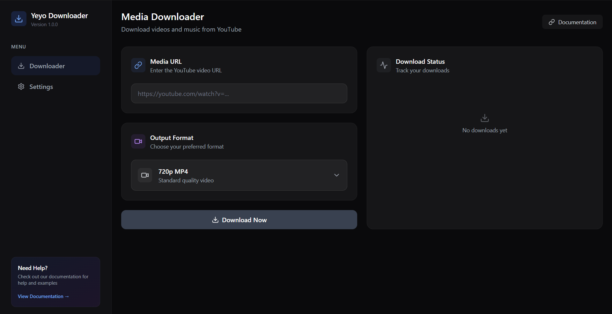

# Yeyo Downloader



Yeyo Downloader adalah aplikasi desktop yang modern dan mudah digunakan untuk mengunduh video dan audio dari berbagai platform online. Dibangun dengan Tauri, Rust, dan React, aplikasi ini menawarkan performa tinggi dalam jejak yang ringkas.

## ✨ Fitur Utama

- **Dukungan Multi-Platform**: Unduh media dari YouTube, Spotify, TikTok, dan banyak situs lain yang didukung oleh `yt-dlp`.
- **Pilihan Format Fleksibel**: Pilih format output yang Anda inginkan, mulai dari video MP4 berkualitas tinggi hingga file audio MP3.
- **Deteksi Cerdas**: Secara otomatis mendeteksi link Spotify dan memilih format audio terbaik.
- **Manajemen File Otomatis**: Secara otomatis menyimpan unduhan video dan audio ke dalam subfolder `Video/` dan `Audio/` untuk menjaga semuanya tetap rapi.
- **Unduhan Playlist**: Tempelkan URL playlist YouTube untuk melihat semua video di dalamnya dan pilih mana yang ingin Anda unduh.
- **Antarmuka Modern**: Antarmuka yang bersih dan intuitif yang dibangun dengan React dan Tailwind CSS.

## 🚀 Instalasi & Penggunaan

### Prasyarat

Sebelum memulai, pastikan Anda telah menginstal prasyarat berikut:

1.  **Node.js & npm**: [https://nodejs.org/](https://nodejs.org/)
2.  **Rust & Cargo**: [https://www.rust-lang.org/tools/install](https://www.rust-lang.org/tools/install)
3.  **Python**: [https://www.python.org/downloads/](https://www.python.org/downloads/)
4.  **yt-dlp & ffmpeg**:
    ```bash
    pip install yt-dlp
    # Instal ffmpeg menggunakan package manager pilihan Anda (misalnya, Chocolatey, Homebrew, apt)
    # Chocolatey: choco install ffmpeg
    # Homebrew: brew install ffmpeg
    ```

### Menjalankan di Mode Development

1.  **Clone repositori ini:**
    ```bash
    git clone https://github.com/your-username/yeyo_downloader.git
    cd yeyo_downloader
    ```

2.  **Instal dependensi Node.js:**
    ```bash
    npm install
    ```

3.  **Jalankan aplikasi:**
    ```bash
    npm run tauri dev
    ```

### Membangun Aplikasi untuk Produksi

Untuk membuat file executable yang dapat didistribusikan, jalankan perintah berikut:

```bash
npm run tauri build
```

Hasil build akan tersedia di direktori `src-tauri/target/release/`.

## 🛠️ Dibangun Dengan

- [**Tauri**](https://tauri.app/) - Toolkit untuk membangun aplikasi desktop dengan backend Rust dan frontend web.
- [**React**](https://reactjs.org/) - Pustaka JavaScript untuk membangun antarmuka pengguna.
- [**Rust**](https://www.rust-lang.org/) - Bahasa pemrograman yang berfokus pada kecepatan, keamanan memori, dan paralelisme.
- [**Python**](https://www.python.org/) - Digunakan untuk menjalankan skrip `yt-dlp`.
- [**yt-dlp**](https://github.com/yt-dlp/yt-dlp) - Inti dari kemampuan pengunduhan aplikasi ini.

